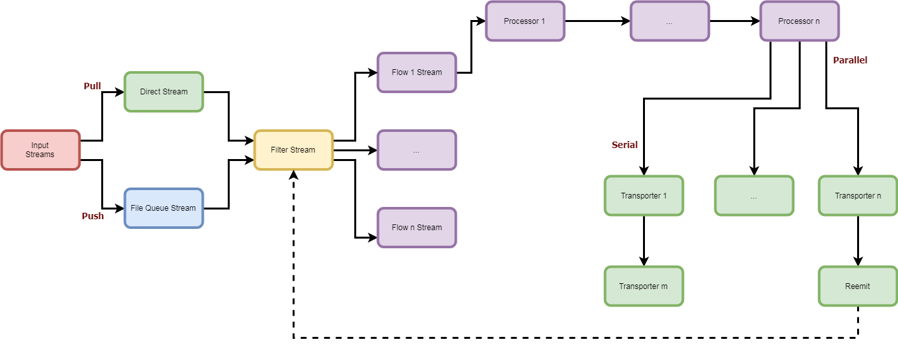

<p align="center">
	
	<i><sub>The next generation logagent and syslog server!</sub></i>
</p>

# nsyslog
NSyslog is a modern, new generation, logagent and syslog server. It features a modular flow architecture of data collectors (inputs), processors and transporters.



Since all the codebase is written in NodeJS, it has a very small memory footprint and excels at data input/output. It also benefits from the excellent [streams framework](https://nodejs.org/api/stream.html) provided natively by node.

### Main Features
* Small memory footprint
* Flow control of push and pull inputs
* On-Disk input data buffering
* A wide core catalog [inputs](doc/inputs/index.md), [processors](doc/processors/index.md) and [transporters](doc/transporters/index.md)
* Extensible with custom inputs, processors and transporters
* Support for Apache Storm multilang protocol
* Multicore flows for parallel processing

### Installation
#### As a CLI app
```
npm install -g nsyslog
```

Then:
```shell
> nsyslog --help
Usage: nsyslog [options]

Options:
  -V, --version            output the version number
  -f, --file [file]        Config file
  -t, --test               Only validate config file
  -L, --log-level [level]  Debug level
  --cli                    Starts CLI session
  --cli-start              Starts CLI session and flows
  -h, --help               output usage information
```

#### As an embedded module
```
npm install -save nsyslog
```

Then:
```javascript
const NSyslog = require('nsyslog');

async function start() {
	let cfg = await NSyslog.readConfig("config.json");
	let nsyslog = new NSyslog(cfg);

	await nsyslog.start();
}

start();
```

Documentation is [available here](doc/README.md)
