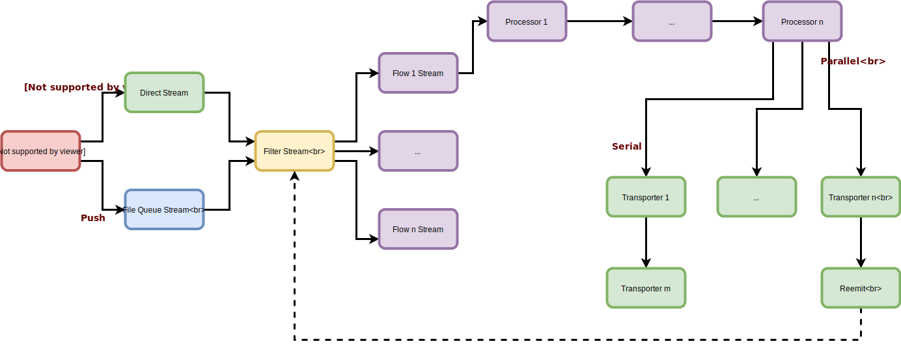

# nsyslog
The next generation log agent and syslog server!

NSyslog is a modern, new generation, log agent and syslog server. It features a modular flow architecture of data collectors (inputs), processors and transporters.

Since all the codebase is written in NodeJS, it has a very small memory footprint and excels at data input/output. It also benefits from the excellent [streams framework](https://nodejs.org/api/stream.html) provided natively by node.

### Main Features
* Small memory footprint
* Flow control of push and pull inputs
* On-Disk input data buffering
* A wide core catalog [inputs](inputs/index.md), [processors](processors/index.md) and [transporters](transporters/index.md)
* Extensible with custom inputs, processors and transporters
* Support for Apache Storm multilang protocol
* Multicore flows for parallel processing

## Quick Start
* [Installation](intro/install.md)
* [Basics](intro/basics.md)

## Configuration File
* [Introduction](config/index.md)
* [Global configurations](config/globals.md)
* [Inputs](inputs/index.md)
* [Filters and Filter Groups](config/filters.md)
* [Processors and Processor Groups](processors/index.md)
* [Transporters and Transporter Groups](transporters/index.md)
* [Flows](config/flows.md)
* [Custom components](config/custom.md)

## API
* [NSyslog](api/nsyslog.md)
* [Input](api/input.md)
* [Processor](api/processor.md)
* [Transporter](api/transporter.md)

## Inputs
* [Apache Kafka](inputs/kafka.md)
* [Command Input](inputs/command.md)
* [File Watcher](inputs/file.md)
* [HTTP Client](inputs/http.md)
* [HTTP Server](inputs/httpserver.md)
* [Redis](inputs/redis.md)
* [Standard Input](inputs/stdin.md)
* [Syslog UDP, TCP and TLS](inputs/syslog.md)
* [WebSocket Server](inputs/ws.md)
* [Windows Events](inputs/windows.md)
* [ZeroMQ](inputs/zmq.md)

## Processors
* [Array](processors/array.md)
* [CSV output](processors/csvout.md)
* [CSV parser](processors/csvparser.md)
* [Date format](processors/dateformat.md)
* [Filter Aggregator](processors/filter.md)
* [Generic parser](processors/parser.md)
* [JSON parser](processors/jsonparser.md)
* [KeyValue parser](processors/keyvalparser.md)
* [Merge](processors/merge.md)
* [Multilang Protocol](processors/multilang.md)
* [Properties](processors/properties.md)
* [Sequence](processors/sequence.md)
* [Split](processors/split.md)
* [Syslog parser](processors/syslogparser.md)
* [Timestamp](processors/timestamp.md)
* [Translate](processors/translate.md)
* [XML parser](processors/xmlparser.md)

## Transporters
* [Console](transporters/console.md)
* [File](transporters/file.md)
* [HTTP](transporters/http.md)
* [Kafka](transporters/kafka.md)
* [MongoDB](transporters/mongo.md)
* [Null](transporters/null.md)
* [Redis](transporters/redis.md)
* [Reemit](transporters/reemit.md)
* [Syslog](transporters/syslog.md)
* [ZeroMQ](transporters/zmq.md)
