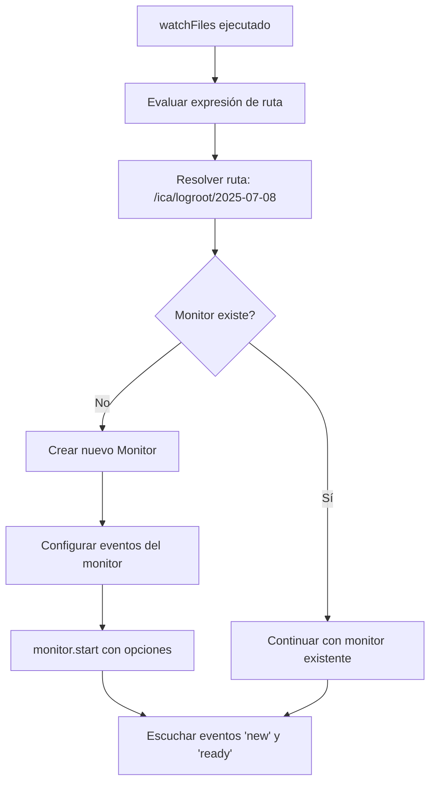
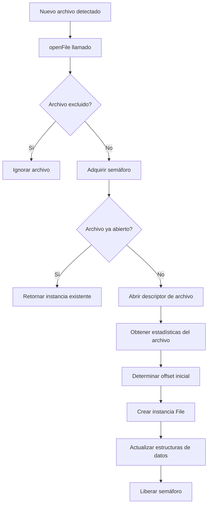
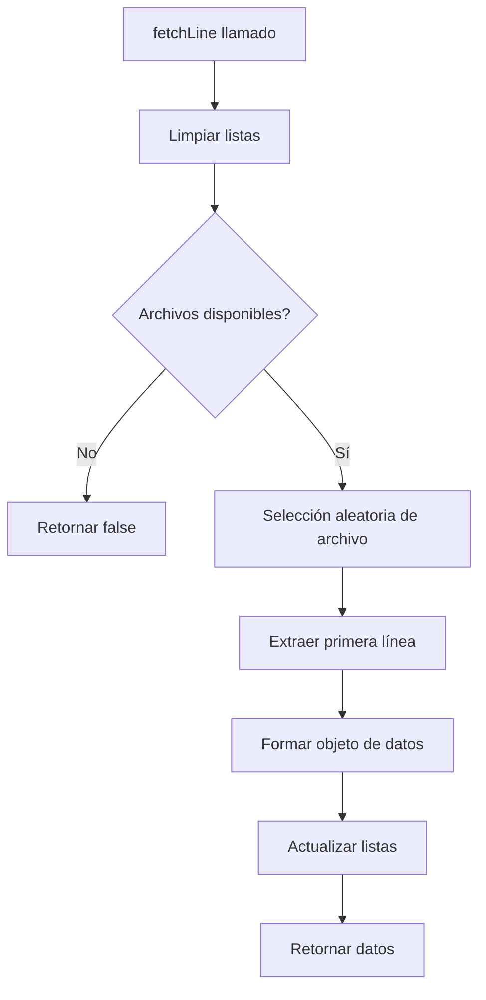

# Análisis Completo del Módulo FileInput

## Descripción General

El módulo `FileInput` es una clase que extiende la clase base `Input` y proporciona funcionalidades para la lectura, monitoreo y gestión de archivos en un sistema de entrada de datos. Este módulo está diseñado para manejar la lectura de archivos de forma eficiente, con soporte para marcas de agua (watermarks), monitoreo en tiempo real y gestión de múltiples archivos simultáneamente.

## Arquitectura y Diseño

### Herencia y Estructura
- **Clase base**: `Input`
- **Patrón**: Singleton por instancia con semáforos para control de concurrencia
- **Modo de operación**: Pull (modo de extracción)

### Dependencias Principales
```javascript
const Input = require('..'),
    Semaphore = require('../../semaphore'),
    jsexpr = require('jsexpr'),
    fs = require('fs-extra'),
    Path = require('path'),
    extend = require('extend'),
    minimatch = require('minimatch'),
    slash = require('slash'),
    logger = require("../../logger"),
    Watermark = require("../../watermark"),
    filesystem = require("./filesystem");
```

## Funcionalidades Principales

### 1. Gestión de Archivos
- **Apertura y lectura de archivos**: Manejo de descriptores de archivo con control de concurrencia
- **Monitoreo de archivos**: Capacidad de vigilar directorios para nuevos archivos
- **Exclusión de archivos**: Soporte para patrones de exclusión usando minimatch
- **Gestión de encoding**: Configuración flexible del encoding de archivos (UTF-8 por defecto)

### 2. Sistema de Watermarks
- **Persistencia de posición**: Mantiene registro de la última posición leída en cada archivo
- **Recuperación de estado**: Capacidad de continuar desde donde se dejó tras reinicio
- **Guardado automático**: Persiste watermarks cada 60 segundos

### 3. Modos de Lectura
- **Modo Offset**: Lectura basada en posición específica
- **Modo Watermark**: Lectura basada en marcas de agua persistentes

### 4. Monitoreo en Tiempo Real
- **Watch de directorios**: Monitoreo activo de nuevos archivos
- **Detección de cambios**: Identificación de modificaciones, truncamiento y rotación de archivos

## Configuración

### Parámetros de Configuración
```javascript
{
    path: "ruta_a_archivos",           // Expresión de ruta (usando jsexpr)
    exclude: "patron_exclusion",       // Patrón de archivos a excluir
    readmode: "offset|watermark",      // Modo de lectura
    offset: "end|begin|start|numero",  // Posición inicial de lectura
    encoding: "utf8",                  // Codificación de archivos
    watch: true|false,                 // Habilitar monitoreo
    blocksize: 10240,                  // Tamaño del buffer de lectura
    options: {}                        // Opciones adicionales
}
```

## Análisis de Código

### ✅ Aspectos Positivos

#### 1. **Gestión de Concurrencia Robusta**
```javascript
await sem.take(); // Adquiere semáforo
try {
    // Operaciones críticas
} finally {
    sem.leave(); // Libera semáforo
}
```
- Uso correcto de semáforos para evitar condiciones de carrera
- Protección de secciones críticas en operaciones de archivo

#### 2. **Manejo de Errores Consistente**
```javascript
try {
    // Operaciones
} catch(err) {
    logger.error(err);
    file.sem.leave(); // Importante: libera recursos incluso en error
    throw err;
}
```

#### 3. **Gestión de Recursos**
- Cierre automático de descriptores de archivo
- Limpieza de intervalos y monitores en `stop()`
- Gestión de memoria con listas de archivos

#### 4. **Flexibilidad de Configuración**
- Soporte para expresiones dinámicas en rutas
- Múltiples modos de lectura
- Configuración granular de comportamiento

#### 5. **Persistencia de Estado**
- Sistema de watermarks robusto
- Recuperación automática de estado
- Guardado periódico de progreso

### ⚠️ Posibles Problemas y Mejoras

#### 1. **Gestión de Memoria**
```javascript
// PROBLEMA: Acumulación potencial de líneas en memoria
file.lines.push({ln:file.line, line});
```
**Riesgo**: Archivos con líneas muy largas o muchas líneas pueden consumir mucha memoria.

**Solución recomendada**:
```javascript
// Implementar límite máximo de líneas en memoria
const MAX_LINES_IN_MEMORY = 1000;
if(file.lines.length >= MAX_LINES_IN_MEMORY) {
    // Procesar o descartar líneas más antiguas
}
```

#### 2. **Manejo de Archivos Corruptos**
```javascript
// PROBLEMA: No hay validación de integridad de archivos
let res = await fs.read(file.fd,file.buffer,0,file.buffer.length,file.offset);
```
**Riesgo**: Archivos corruptos pueden causar comportamiento impredecible.

**Mejora sugerida**:
```javascript
try {
    let res = await fs.read(file.fd,file.buffer,0,file.buffer.length,file.offset);
    // Validar que res.bytesRead sea razonable
    if(res.bytesRead < 0 || res.bytesRead > file.buffer.length) {
        throw new Error(`Invalid bytes read: ${res.bytesRead}`);
    }
} catch(err) {
    logger.error(`Error reading file ${file.path}: ${err.message}`);
    // Marcar archivo como problemático
}
```

#### 3. **Detección de Rotación de Archivos**
```javascript
// PROBLEMA: La detección de rotación solo verifica inode
if(fstat.ino != file.stats.ino) {
    logger.warn(`File ${file.path} seems to be another file. Reseting reference.`);
}
```
**Limitación**: En algunos sistemas de archivos, el inode puede no cambiar.

**Mejora sugerida**:
```javascript
// Verificar múltiples propiedades del archivo
if(fstat.ino != file.stats.ino || 
   fstat.mtime.getTime() < file.stats.mtime.getTime() ||
   fstat.ctime.getTime() < file.stats.ctime.getTime()) {
    logger.warn(`File ${file.path} appears to have been rotated or replaced`);
    // Resetear referencia
}
```

#### 4. **Timeout en Operaciones de Archivo**
```javascript
// PROBLEMA: No hay timeout para operaciones de E/S
let fd = await fs.open(path, 'r');
```
**Riesgo**: Operaciones de archivo pueden colgarse indefinidamente.

**Solución**:
```javascript
const OPERATION_TIMEOUT = 30000; // 30 segundos
const withTimeout = (promise, timeout) => {
    return Promise.race([
        promise,
        new Promise((_, reject) => 
            setTimeout(() => reject(new Error('Operation timeout')), timeout)
        )
    ]);
};

let fd = await withTimeout(fs.open(path, 'r'), OPERATION_TIMEOUT);
```

#### 5. **Validación de Configuración**
```javascript
// PROBLEMA: Falta validación robusta de configuración
async configure(config, callback) {
    config = config || {};
    this.path = jsexpr.expr(config.path);
    // ...
}
```

**Mejora**:
```javascript
async configure(config, callback) {
    if (!config) {
        return callback(new Error('Configuration is required'));
    }
    if (!config.path) {
        return callback(new Error('Path configuration is required'));
    }
    
    try {
        this.path = jsexpr.expr(config.path);
    } catch(err) {
        return callback(new Error(`Invalid path expression: ${err.message}`));
    }
    // ...
}
```

#### 6. **Logging Excesivo**
```javascript
// PROBLEMA: Muchos logs en nivel silly pueden afectar rendimiento
logger.silly(`Reading ${file.path} from ${file.offset}`);
```
**Solución**: Implementar logging condicional o por niveles configurables.

### 🔧 Optimizaciones Sugeridas

#### 1. **Pool de Descriptores de Archivo**
```javascript
class FileDescriptorPool {
    constructor(maxSize = MAX_OPEN) {
        this.pool = new Map();
        this.maxSize = maxSize;
        this.lru = []; // Least Recently Used
    }
    
    async get(path) {
        if (this.pool.has(path)) {
            // Mover al final del LRU
            this.lru = this.lru.filter(p => p !== path);
            this.lru.push(path);
            return this.pool.get(path);
        }
        
        // Si el pool está lleno, cerrar el menos usado
        if (this.pool.size >= this.maxSize) {
            const oldest = this.lru.shift();
            const fd = this.pool.get(oldest);
            await fs.close(fd);
            this.pool.delete(oldest);
        }
        
        const fd = await fs.open(path, 'r');
        this.pool.set(path, fd);
        this.lru.push(path);
        return fd;
    }
}
```

#### 2. **Buffering Inteligente**
```javascript
// Ajustar tamaño de buffer basado en tamaño de archivo
calculateOptimalBufferSize(fileSize) {
    if (fileSize < 1024 * 10) return 1024; // 1KB para archivos pequeños
    if (fileSize < 1024 * 1024) return 1024 * 10; // 10KB para archivos medianos
    return 1024 * 64; // 64KB para archivos grandes
}
```

#### 3. **Procesamiento Asíncrono Mejorado**
```javascript
// Usar async iterators para mejor manejo de flujo
async* readLinesIterator() {
    while (!this.closed) {
        const files = await this.readlines();
        for (const file of files) {
            while (file.lines.length > 0) {
                yield this.formatLine(file.lines.shift(), file);
            }
        }
        if (!this.hasAvailableLines()) {
            await this.sleep(100); // Espera antes de siguiente iteración
        }
    }
}
```

## Patrones de Diseño Utilizados

### 1. **Observer Pattern**
- Monitoreo de archivos con eventos (`new`, `ready`)
- Callbacks para notificaciones de estado

### 2. **Strategy Pattern**
- Diferentes modos de lectura (offset vs watermark)
- Configuración flexible de comportamiento

### 3. **Resource Pool Pattern**
- Gestión de descriptores de archivo
- Control de recursos limitados

### 4. **State Pattern**
- Estados de archivo (ready, reading, closed)
- Transiciones controladas

## Casos de Uso Típicos

### 1. **Lectura de Logs en Tiempo Real**
```javascript
const fileInput = new FileInput('logs', 'file');
await fileInput.configure({
    path: '/var/log/*.log',
    watch: true,
    readmode: 'watermark',
    offset: 'end'
});
```

### 2. **Procesamiento de Archivos Históricos**
```javascript
const fileInput = new FileInput('batch', 'file');
await fileInput.configure({
    path: '/data/historical/*.txt',
    watch: false,
    readmode: 'offset',
    offset: 'begin'
});
```

### 3. **Monitoreo con Exclusiones**
```javascript
const fileInput = new FileInput('monitor', 'file');
await fileInput.configure({
    path: '/logs/**/*.log',
    exclude: '*/temp/*',
    watch: true,
    readmode: 'watermark'
});
```

## Análisis del Flujo de Ejecución

### Caso de Uso: Monitoreo de Logs con Estructura de Fechas

Para el caso específico de monitorizar archivos bajo la ruta `/ica/logroot/${YYYY-MM-DD}/*.log`, analizaremos el flujo completo de ejecución desde la inicialización hasta el procesamiento continuo.

#### Configuración del Caso de Uso
```javascript
const fileInput = new FileInput('daily-logs', 'file');
await fileInput.configure({
    path: '/ica/logroot/${YYYY-MM-DD}/*.log',
    watch: true,
    readmode: 'watermark',
    offset: 'end',
    encoding: 'utf8',
    blocksize: 65536, // 64KB para archivos de log grandes
    options: {
        persistent: true,
        recursive: false
    }
});
```

### 🔄 Flujo de Ejecución Detallado

#### **Fase 1: Inicialización (constructor + configure)**

```mermaid
graph TD
    A[Constructor FileInput] --> B[Inicializar propiedades]
    B --> C[configure() llamado]
    C --> D[Parsear expresión de ruta con jsexpr]
    D --> E[Configurar parámetros]
    E --> F[Callback de configuración]
```

**1.1 Constructor**
```javascript
// Estado inicial
this.files = {};                    // Mapa de archivos abiertos
this.list = { read: {}, avail: {} }; // Listas de control
this.sem = new Semaphore(1);        // Control de concurrencia
this.watermark = null;              // Sistema de marcas de agua
this.wm = null;                     // Datos de watermarks
this.monitors = new Map();          // Monitores de directorios
```

**1.2 Configuración**
```javascript
// La expresión jsexpr se evalúa dinámicamente
this.path = jsexpr.expr('/ica/logroot/${YYYY-MM-DD}/*.log');
// Resultado: función que genera rutas como "/ica/logroot/2025-07-08/*.log"
```

#### **Fase 2: Inicio del Sistema (start)**

```mermaid
graph TD
    A[start() llamado] --> B[Inicializar Watermark]
    B --> C[Cargar watermarks existentes]
    C --> D{watch = true?}
    D -->|Sí| E[Iniciar watchFiles]
    D -->|No| F[Buscar archivos con glob]
    E --> G[Configurar intervalo de monitoreo]
    F --> H[Abrir archivos encontrados]
    G --> I[Configurar guardado automático]
    H --> I
    I --> J[Sistema listo]
```

**2.1 Inicialización de Watermarks**
```javascript
try {
    this.watermark = new Watermark(this.config.$datadir);
    await this.watermark.start();
    this.wm = await this.watermark.get(this.id); // Obtener watermarks de "daily-logs"
} catch(err) {
    return callback(err);
}
```

**2.2 Inicio del Monitoreo**
```javascript
if(this.watch) {
    await this.watchFiles(); // Primera ejecución
    this.ivalWatch = setInterval(async()=>{
        await this.watchFiles(); // Cada 5 segundos
    }, 5000);
}
```

**2.3 Configuración de Guardado Automático**
```javascript
this.wmival = setInterval(this.save.bind(this), 60000); // Cada 60 segundos
```

#### **Fase 3: Monitoreo de Directorios (watchFiles)**



**3.1 Evaluación Dinámica de Rutas**
```javascript
const path = slash(Path.resolve(config.$path, this.path("")));
// Resultado: "/ica/logroot/2025-07-08" (fecha actual)
```

**3.2 Creación del Monitor**
```javascript
if(!this.monitors.has(path)) {
    const monitor = new Monitor(this.files);
    this.monitors.set(path, monitor);
    monitor.start(path, this.options);
    
    // Eventos del monitor
    monitor.on('new', path => this.openFile(path));    // Nuevo archivo detectado
    monitor.on('ready', path => {                      // Archivo listo para lectura
        this.list.read[path] = true;
    });
}
```

#### **Fase 4: Detección y Apertura de Archivos (openFile)**



**4.1 Exclusión de Archivos**
```javascript
// Para nuestro caso: /ica/logroot/2025-07-08/application.log
if (this.exclude && minimatch(path, this.exclude)) {
    logger.info(`${path} is excluded`);
    return;
}
```

**4.2 Determinación del Offset**
```javascript
if (this.readmode == MODE.watermark) {
    if (wm[path]) {
        // Archivo conocido - continuar desde watermark
        offset = wm[path].offset || 0;
        tail = wm[path].tail || "";
        line = wm[path].line || 0;
        lines = wm[path].lines || [];
    } else {
        // Archivo nuevo - empezar desde el final (offset: 'end')
        offset = stats.size;
    }
}
```

**4.3 Creación de la Instancia File**
```javascript
files[path] = new File(path, fd, stats, offset, buffer, tail, line, lines);
files[path].ready = true;
this.list.read[path] = true;  // Marcar para lectura
extend(true, wm, { [path]: files[path].toJSON() });
```

#### **Fase 5: Procesamiento Continuo (next + readlines)**

```mermaid
graph TD
    A[next() llamado] --> B[fetchLine()]
    B --> C{Líneas disponibles?}
    C -->|Sí| D[Retornar línea]
    C -->|No| E[readlines()]
    E --> F[Para cada archivo en lectura]
    F --> G[Leer buffer del archivo]
    G --> H[Procesar contenido]
    H --> I[Dividir en líneas]
    I --> J[Actualizar watermarks]
    J --> K[fetchLine() nuevamente]
    K --> L{Líneas disponibles?}
    L -->|Sí| M[Retornar línea]
    L -->|No| N[Retornar false]
```

**5.1 Lectura de Archivos (readlines)**
```javascript
// Para cada archivo marcado para lectura
let files = this.watch?
    Object.keys(this.list.read).map(k=>this.files[k]) :
    Object.keys(this.files).map(k=>this.files[k]);

// Lectura asíncrona paralela
let all = files.filter(Boolean).map(async(file)=>{
    await this.openFile(file.path);
    await file.sem.take();
    
    // Leer desde la posición actual
    let res = await fs.read(file.fd, file.buffer, 0, file.buffer.length, file.offset);
    file.tail += res.buffer.toString('utf8', 0, res.bytesRead);
    file.offset += res.bytesRead;
    
    // Procesar líneas completas
    let lines = file.tail.split("\n");
    while(lines.length) {
        let line = lines.shift();
        if(lines.length) {
            file.line++;
            file.lines.push({ln:file.line, line});
        } else {
            file.tail = line; // Línea incompleta
        }
    }
    
    file.sem.leave();
    return file;
});
```

**5.2 Manejo de Casos Especiales**
```javascript
// Detección de truncamiento o rotación
if(res.bytesRead == 0) {
    let fstat = await fs.stat(file.path);
    if((fstat.size < file.offset) || (fstat.ino != file.stats.ino)) {
        if(fstat.ino != file.stats.ino) {
            logger.warn(`File ${file.path} seems to be another file. Reseting reference.`);
        } else {
            logger.warn(`File ${file.path} has been truncated. Reseting watermark`);
        }
        file.offset = 0; // Reiniciar desde el principio
        // Cerrar y reabrir el archivo
    }
}
```

#### **Fase 6: Entrega de Datos (fetchLine)**



**6.1 Estructura de Datos Retornada**
```javascript
// Para archivo: /ica/logroot/2025-07-08/application.log, línea 1542
let data = {
    type: 'file',
    path: '/ica/logroot/2025-07-08/application.log',
    filename: 'application.log',
    ln: 1542,
    originalMessage: '2025-07-08 14:30:45 INFO [main] Application started successfully'
};
```

### 🕐 Cronología de Eventos para el Caso de Uso

#### **T+0s: Inicialización**
```
14:00:00 - Constructor FileInput('daily-logs', 'file')
14:00:00 - configure() con path '/ica/logroot/${YYYY-MM-DD}/*.log'
14:00:00 - start() iniciado
14:00:01 - Watermark cargado desde disco
14:00:01 - watchFiles() - monitorear /ica/logroot/2025-07-08/
```

#### **T+1s: Detección Inicial**
```
14:00:02 - Monitor detecta: application.log, error.log, access.log
14:00:02 - openFile(/ica/logroot/2025-07-08/application.log)
14:00:02 - openFile(/ica/logroot/2025-07-08/error.log)
14:00:02 - openFile(/ica/logroot/2025-07-08/access.log)
14:00:03 - Archivos listos para lectura
```

#### **T+5s: Primera Lectura**
```
14:00:05 - next() llamado por primera vez
14:00:05 - readlines() lee buffers de los 3 archivos
14:00:05 - 47 líneas procesadas de application.log
14:00:05 - 12 líneas procesadas de error.log
14:00:05 - 156 líneas procesadas de access.log
14:00:05 - fetchLine() retorna línea de access.log
```

#### **T+5s-60s: Procesamiento Continuo**
```
14:00:06 - next() → fetchLine() → línea de application.log
14:00:07 - next() → fetchLine() → línea de error.log
...
14:00:30 - Monitor detecta nuevo archivo: debug.log
14:00:30 - openFile(/ica/logroot/2025-07-08/debug.log)
...
14:01:00 - save() automático ejecutado
14:01:00 - Watermarks persistidos para 4 archivos
```

#### **T+24h: Rotación Diaria**
```
00:00:00 - watchFiles() evalúa nueva fecha
00:00:00 - Nueva ruta: /ica/logroot/2025-07-09/
00:00:01 - Nuevo monitor creado para directorio 2025-07-09
00:00:05 - Archivos del día anterior siguen siendo monitoreados
00:00:10 - Nuevos archivos detectados en directorio actual
```

### 📊 Métricas de Rendimiento del Flujo

#### **Latencia de Detección**
- **Nuevos archivos**: ~1-2 segundos (intervalo del monitor del filesystem)
- **Nuevas líneas**: ~0-100ms (dependiente de la frecuencia de `next()`
- **Rotación de archivos**: ~1-5 segundos

#### **Throughput**
- **Lectura secuencial**: ~10-50 MB/s (dependiente del disco)
- **Líneas por segundo**: ~1000-10000 (dependiente del tamaño de línea)
- **Archivos simultáneos**: Sin límite teórico (limitado por descriptores de archivo del SO)

#### **Uso de Memoria**
```javascript
// Estimación para el caso de uso
const memoryUsage = {
    watermarks: '~1KB por archivo',
    fileDescriptors: '~8KB por archivo abierto',
    buffers: '64KB × número de archivos activos',
    lineas_memoria: 'variable (riesgo de acumulación)'
};
```

### ⚠️ Consideraciones Específicas del Caso de Uso

#### **1. Gestión de Directorios por Fecha**
- **Ventaja**: Organización clara y rotación natural
- **Desafío**: Necesidad de múltiples monitores activos
- **Recomendación**: Limitar monitores a N días recientes

#### **2. Patrones de Crecimiento de Logs**
```javascript
// Patrón típico diario
const growthPattern = {
    '00:00-06:00': 'Bajo (mantenimiento)',
    '06:00-09:00': 'Creciente (inicio de actividad)',
    '09:00-17:00': 'Alto (actividad normal)',
    '17:00-00:00': 'Decreciente'
};
```

#### **3. Optimizaciones Específicas**
```javascript
// Configuración optimizada para logs diarios
const optimizedConfig = {
    blocksize: 131072,        // 128KB para archivos de log grandes
    watch: true,
    readmode: 'watermark',
    offset: 'end',
    options: {
        persistent: true,
        recursive: false,      // No buscar en subdirectorios
        awaitWriteFinish: {    // Esperar que termine la escritura
            stabilityThreshold: 2000,
            pollInterval: 100
        }
    }
};
```

### 🔍 Puntos de Monitoreo y Debug

#### **Métricas Clave a Monitorear**
```javascript
const metrics = {
    files_monitored: 'Número de archivos bajo monitoreo',
    lines_processed: 'Líneas procesadas por segundo',
    watermark_lag: 'Diferencia entre tamaño de archivo y watermark',
    memory_usage: 'Uso de memoria del proceso',
    file_descriptors: 'Número de descriptores abiertos',
    monitor_directories: 'Directorios bajo monitoreo activo'
};
```

#### **Logs de Debug Útiles**
```javascript
// Habilitar en desarrollo
logger.level = 'silly';

// Logs específicos a buscar:
// "Found ${path} in watermarks" - Archivo conocido
// "Not found ${path} in watermarks" - Archivo nuevo  
// "File ${path} has been truncated" - Rotación detectada
// "Reading ${file.path} from ${file.offset}" - Lectura activa
// "Nothing to read from ${file.path}" - Archivo sin cambios
```

Este análisis proporciona una visión completa del flujo de ejecución para el caso de uso específico, identificando los puntos críticos, optimizaciones posibles y métricas de rendimiento esperadas.

## Conclusiones

El módulo `FileInput` es una implementación robusta y bien estructurada para el manejo de archivos de entrada. Sus principales fortalezas incluyen:

1. **Gestión de concurrencia sólida** con semáforos
2. **Sistema de watermarks persistente** para recuperación de estado
3. **Flexibilidad de configuración** para diferentes casos de uso
4. **Monitoreo en tiempo real** de sistemas de archivos

Las áreas de mejora principales se centran en:

1. **Gestión de memoria** más estricta
2. **Validación y manejo de errores** más robustos  
3. **Optimizaciones de rendimiento** para casos de alto volumen
4. **Métricas y monitoreo** integrados

En general, el código demuestra buenas prácticas de programación asíncrona en Node.js y proporciona una base sólida para un sistema de ingesta de archivos de nivel empresarial.

## Versión del Análisis
- **Fecha**: 8 de Julio, 2025
- **Archivo analizado**: `c:\opt\nsyslog\lib\input\file\index.js`
- **Líneas de código**: ~400+ líneas
- **Complejidad**: Media-Alta
